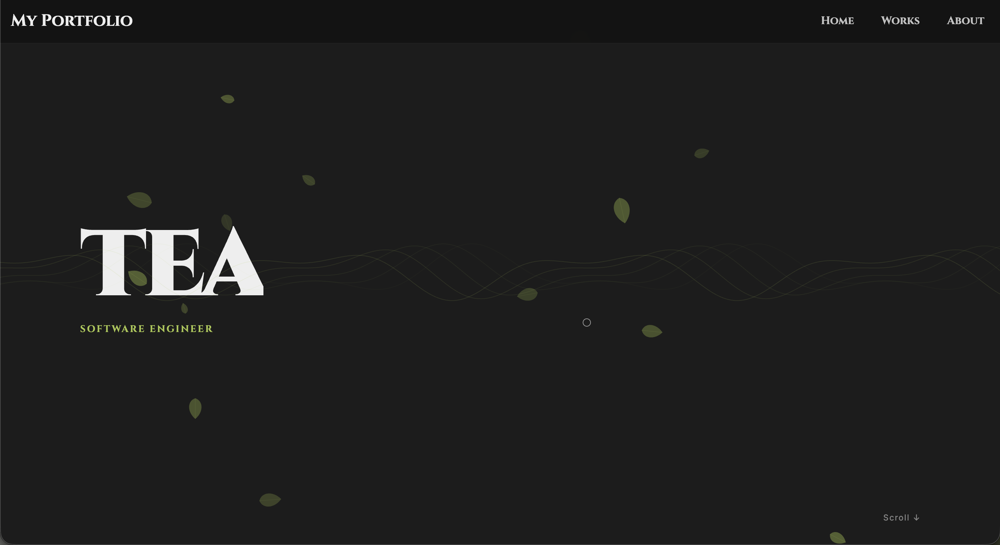

# portfolio

teaのポートフォリオサイト。ソフトウェアエンジニアとしての作品と経歴を紹介。

## 概要

- お茶をテーマにした若草色のデザイン
- 葉っぱが風に揺れるCanvasアニメーション
- Works・About・スキル一覧を掲載

## 工夫点

### デザイン・世界観
- ユーザー名「tea」にちなんだお茶をテーマにしたデザイン
- 若草色（#A8C84A）をアクセントカラーとして採用
- 彫刻的なフォント「Cinzel」で個性を表現

### アニメーション・エフェクト
- Canvasで実装したお茶の葉っぱが風に揺れる背景（HeroセクションHeroBg）

### CI/CD・開発環境
- GitHub ActionsでESLint・TypeScript型チェックを自動実行
- PRマージ時にVercelへ自動デプロイ

## 技術スタック


## セットアップ

```bash
# リポジトリのクローン
git clone https://github.com/tea35/portfolio.git
cd portfolio

# 依存パッケージのインストール
npm install

# 開発サーバーの起動
npm run dev
```

ブラウザで [http://localhost:3000](http://localhost:3000) を開く。

## スクリーンショット
### Hero

